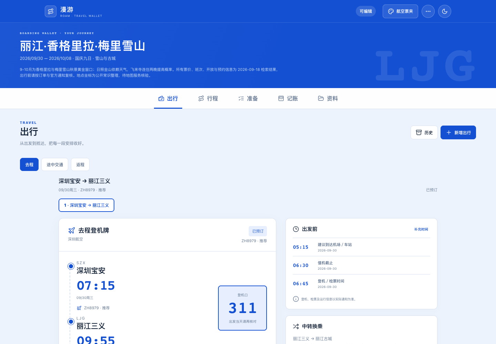
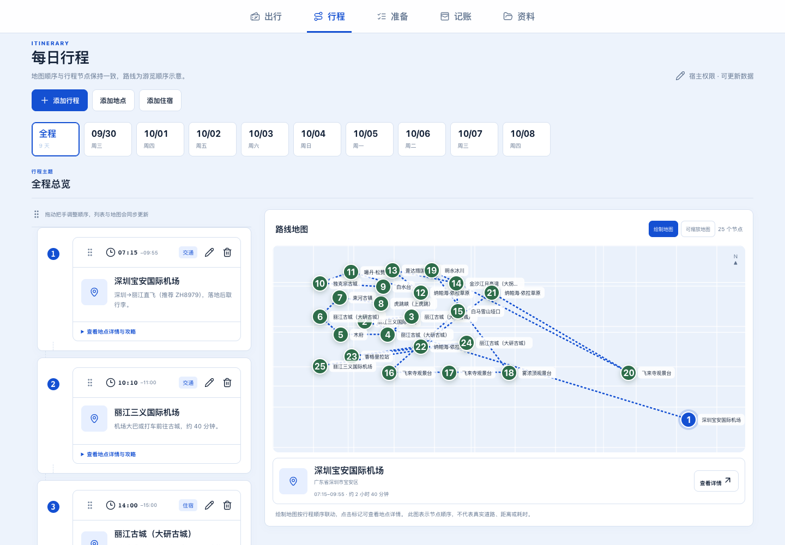
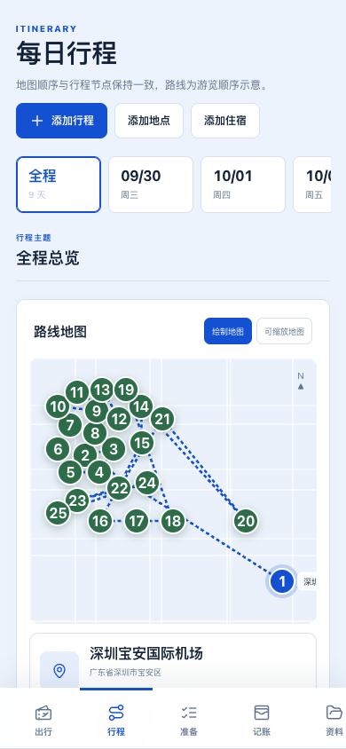

# Hks-Travel-Skill

English · [中文](README.md)

Hks-Travel-Skill is a travel-planning skill for Codex and compatible agents. It connects destination research, route approval, six visual previews, TravelPack generation, editable web deployment, and safe upgrades of existing sites.

Current version: `4.12.0`<br>
Skill ID: `hks-travel-skill`

## Screenshots

These screenshots come from a real deployment. They were reviewed for public release and contain no email addresses, verification codes, access tokens, map keys, or local runtime information.

### Travel wallet



### Itinerary and route map



### Mobile layout



## Features

- Researches destinations, transportation, areas to stay, reservation rules, and seasonal conditions with source and freshness metadata.
- Presents six visual directions before production deployment: aviation, natural, minimal, collage, print, and urban.
- Generates and validates TravelPack 1.1.0.
- Delivers a five-module travel app covering transport, itinerary, preparation, expenses, and materials.
- Supports pointer-based reordering, tasks, calendar export, shared expenses, attachments, and read-only sharing.
- Routes deployment across host-native clouds, WorkBuddy, Cloudflare, Codex Sites, and generic preview environments.
- Upgrades existing deployments with a public manifest, backup, migration verification, acceptance checks, and a rollback point.

## Installation

Clone the repository and copy the skill directory into your agent's Skills directory:

```bash
git clone https://github.com/HANKSEN/Hks-Travel-Skill.git
cp -R Hks-Travel-Skill/hks-travel-skill ~/.codex/skills/hks-travel-skill
```

For another compatible agent, place `hks-travel-skill/` in the Skills directory documented by that product. Restart or refresh the agent and confirm that `$hks-travel-skill` is available.

## Usage

```text
Use $hks-travel-skill to plan a nine-day trip to Lijiang and Shangri-La.
Confirm my preferences and route first, show me the UI styles, and deploy an editable site only after I approve deployment.
```

To upgrade an existing deployment:

```text
Use the latest Hks-Travel-Skill to upgrade this site: <site URL>.
Preserve the database, user edits, attachments, access links, and domain. Back up first, then verify both edit and read-only flows.
```

A newer skill package does not mutate a live deployment automatically. The agent reads `travel-app-manifest.json`, locates the original project, and produces an upgrade plan. Legacy sites without a manifest go through an audit and backup first.

## Maps

Map MCP tools, WebService APIs, and browser basemaps are separate capabilities. An MCP tool can provide places and routes. Browser maps from Tencent, AMap, and similar providers usually require an official web key, a domain allowlist, and a frontend adapter. The skill explains required setup and waits for authorization when an account, key, OAuth flow, or billing may be involved.

Inject credentials through the host identity system, secret manager, or environment variables. Never place keys, verification codes, or access tokens in TravelPack, chat transcripts, logs, or public manifests.

## Repository layout

```text
Hks-Travel-Skill/
├── hks-travel-skill/
│   ├── SKILL.md
│   ├── agents/
│   ├── assets/
│   ├── references/
│   └── scripts/
├── docs/screenshots/
├── scripts/audit-public-tree.mjs
├── tests/
├── PRIVACY.md
├── SECURITY.md
└── THIRD_PARTY_NOTICES.md
```

`SKILL.md` contains the core workflow and boundaries. Host adapters, data contracts, maps, deployment, and upgrade details live under `references/`. Deterministic validation and packaging helpers live under `scripts/`.

## Development

Node.js 20 or newer is required. The repository has no runtime npm dependencies.

```bash
npm run audit
npm test
npm run check
```

`npm run audit` rejects common secrets, real email addresses, absolute home paths, databases, logs, caches, and release archives. Before publishing, also review screenshots, Git history, and the hosting platform's secret-scanning result.

## Privacy and security

Read [PRIVACY.md](PRIVACY.md), [SECURITY.md](SECURITY.md), and the [open-source audit record](docs/OPEN_SOURCE_AUDIT.md) before publishing. The public tree contains only the skill, anonymous sample data, and reviewed screenshots. Production databases, verification emails, mail outboxes, browser state, cloud caches, local logs, and old release archives must stay outside the repository.

## Third-party software

The frontend template bundles Leaflet 1.9.4 and Lucide 0.468.0. See [THIRD_PARTY_NOTICES.md](THIRD_PARTY_NOTICES.md) for license notices.

## License

The project is available under the [MIT License](LICENSE). Bundled third-party software remains under its respective license.
